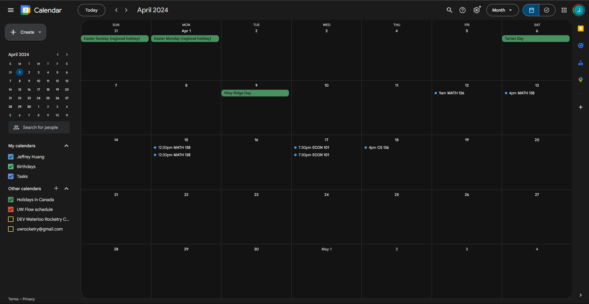

# UW Exam Exporter Extension

## What does this extension do?

The UW Exam Exporter Extension automatically parses Quest for the user's courses and reads each courses exam information from a database. The database compiles information from the exam information pdf released by UW.

## Setup

### Requirements

A browser that is Chromium-based or supports Chrome extensions is required to use this

### Installation

1. Go to chrome://extensions on Google Chrome or the alternative on your browser
2. Click "Load unpacked"
3. Select the "..\uw-exam-exporter\frontend_react\dist" folder

## Usage - Exam Exporter Extension 

1. Navigate to the Class Schedule page in Quest. Ensure you are on the list view and not the calendar view. 
2. Enter the extension and select the extract courses button. 
3. Once the course results have appeared, drop the exams that you don't need. < br / > 
4. Click the generate .ics button and wait for the .ics to download.   
5. Import the downloaded .ics file in a calendar application that supports .ics.   

